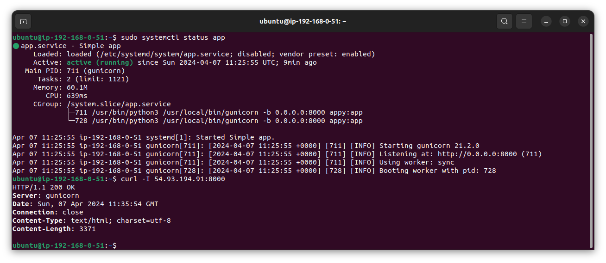
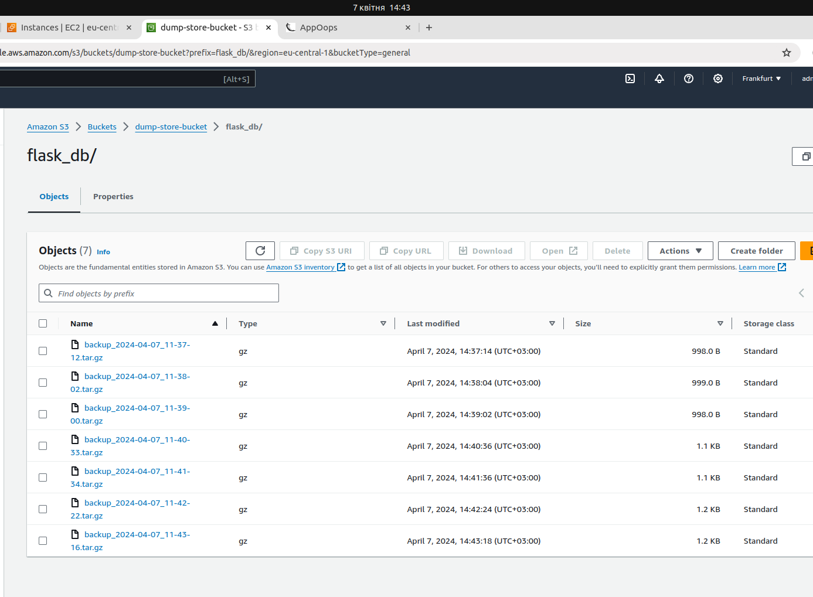
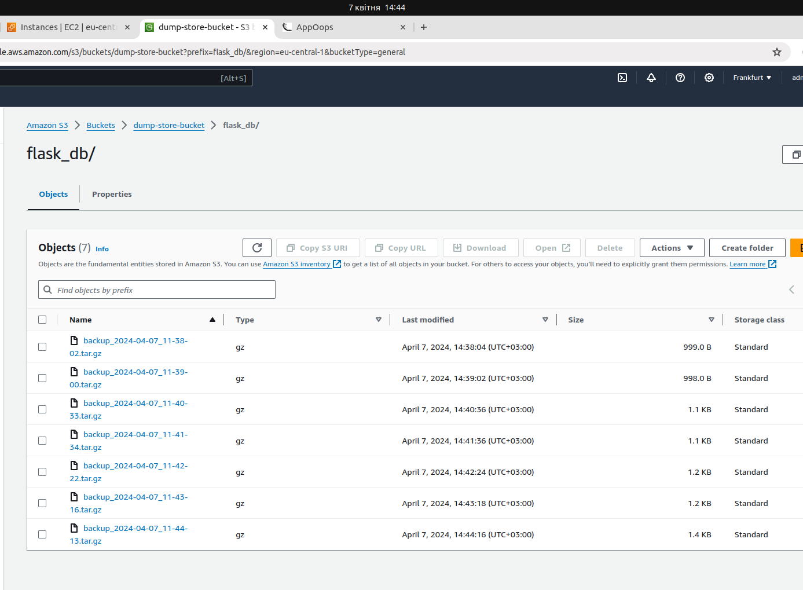

## Intro

- `APP_AMI_ID`
- `DB_AMI_ID`
- `APP_PROFILE_NAME`
- `DB_PROFILE_NAME`
- `SG_APP_ID`
- `SG_DB_ID`
- `APP_SUBNET_ID`
- `DB_SUBNET_ID`

---

## Створення інстансів на основі [IAM практики](../awscli/IAM.md)

> Для функціонування сервісу дампів, необхідно попередньо до db інстанс профайла додати права на отримання ім'я бакету,
> та роботи з файлами у бакеті.

### 1. Створення `DB` інстансу:

```
aws ec2 run-instances \
    --image-id "$DB_AMI_ID" \
    --count 1 \
    --instance-type t2.micro \
    --iam-instance-profile Name="$DB_PROFILE_NAME" \
    --key-name homework-key \
    --security-group-ids $SG_DB_ID \
    --subnet-id $DB_SUBNET_ID \
    --user-data file://scripts/user_data/db.sh \
    --tag-specifications 'ResourceType=instance,Tags=[{Key=task,Value=4},{Key=Name,Value=DB}]'
```

### 2. Створення `APP` інстансу:

```
aws ec2 run-instances \
    --image-id "$APP_AMI_ID" \
    --count 1 \
    --instance-type t2.micro \
    --iam-instance-profile Name="$APP_PROFILE_NAME" \
    --key-name homework-key \
    --security-group-ids $SG_APP_ID $SG_DB_ID \
    --user-data file://scripts/user_data/app.sh \
    --subnet-id $APP_SUBNET_ID \
    --tag-specifications 'ResourceType=instance,Tags=[{Key=task,Value=4},{Key=Name,Value=APP}]'
```

## Запущений додаток



## Демонстрація ротації дампів за розкладом

### До



### Після


