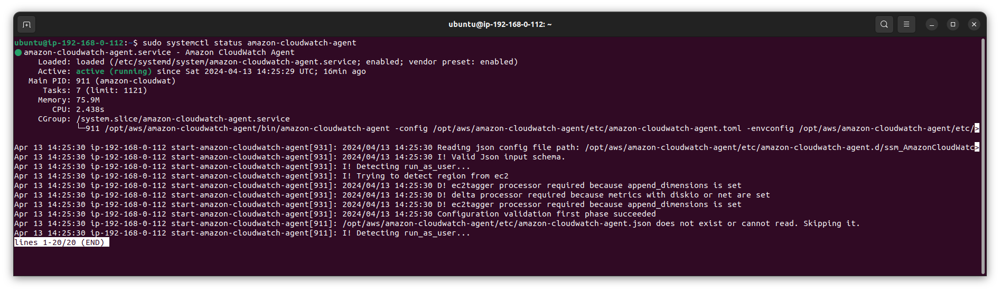

## Intro

- `ACCOUNT_ID`
- `READ_AGENT_CONFIG`
- `APP_ROLE_NAME`
- `DB_ROLE_NAME`

---

1. За допомогою `amazon-cloudwatch-agent-config-wizard` створюю [налаштування](CW-agent-config.json) та зберігаю його
   у `Parameter Store`
2. Створюю політику отримання налаштувань агента та додаю її до ролі інстанс профайлів.

   ```
   aws iam create-policy \
       --policy-name "$READ_AGENT_CONFIG" \
       --policy-document file://../awscli/policies/read_agent_config.json \
       --tags Key=task,Value=5
   ```

   ```
   aws iam attach-role-policy \
       --role-name "$c" \
       --policy-arn arn:aws:iam::"$ACCOUNT_ID":policy/"$READ_AGENT_CONFIG"
   ```

   ```
   aws iam attach-role-policy \
       --role-name "$DB_ROLE_NAME" \
       --policy-arn arn:aws:iam::"$ACCOUNT_ID":policy/"$READ_AGENT_CONFIG"
   ```

3. Повторюю пункти з [попереднього](HW4.md) завдання.

---
Агент запущений на обох інстансах.


