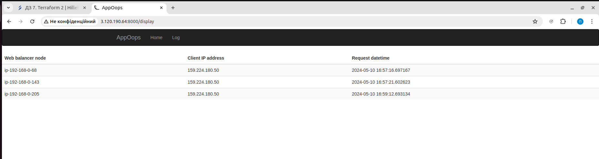

### Результат розгортання dev оточення.
```
curl -I 3.68.84.83:8000 | tee curl_dev.txt
```
> [Вивід](output/curl_dev.txt)

> Копія [inventory файлу який був згенерований](output/dev_hosts)

### Результат розгортання prod оточення.
Після відвідування всіх трьох інстансів:


> Копія [inventory файлу який був згенерований](output/prod_hosts)
