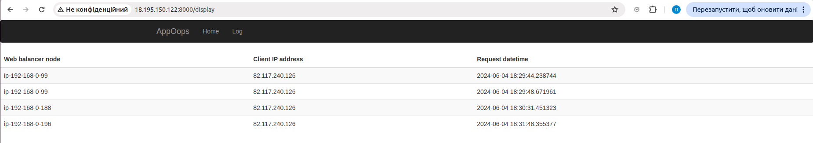

### Результат розгортання prod оточення.
Після відвідування всіх трьох інстансів:


### Примітка

- Після розгортання інфраструктури тераформом, у каталозі /terraform/ansible для створення юзера та запуску додатку було виконано
```
ansible-playbook -i ../files/prod_hosts deploy.yml
```
